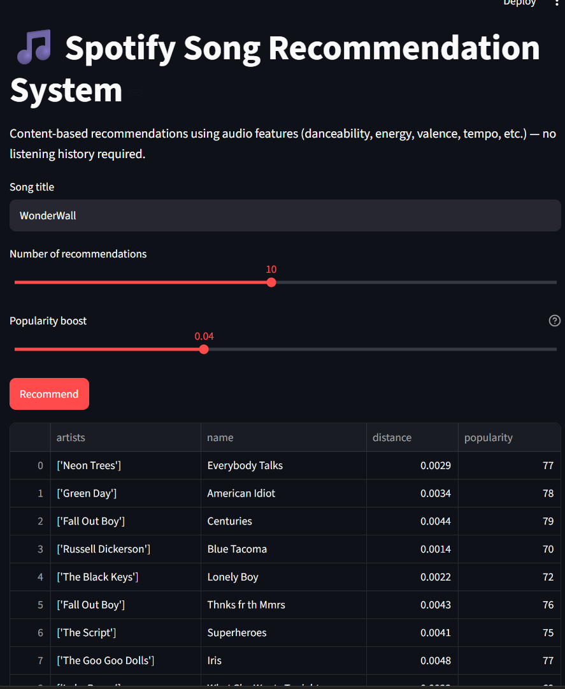
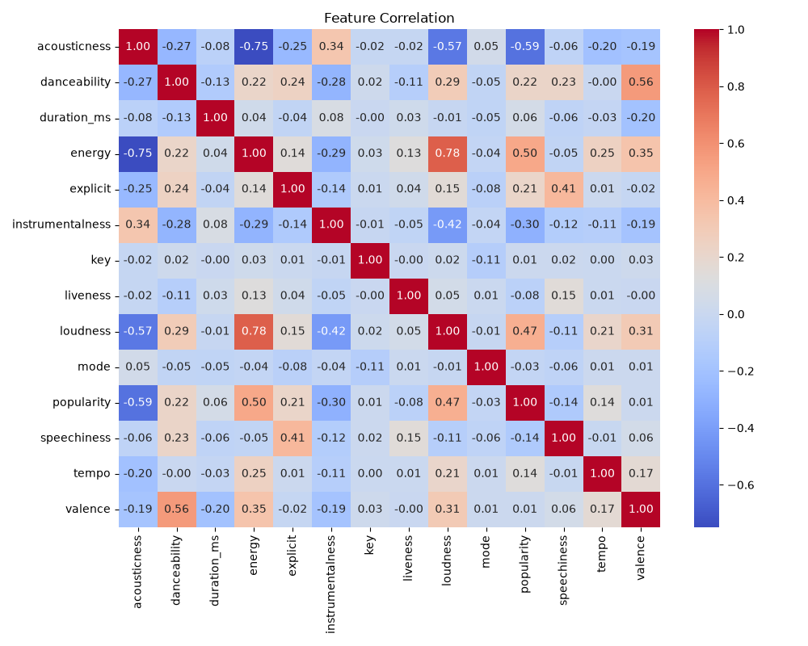
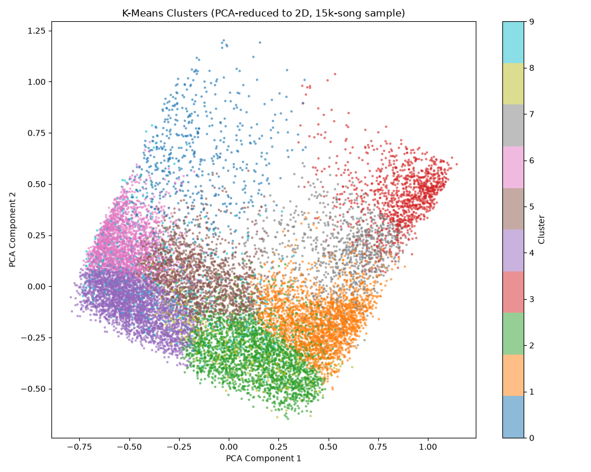

# Spotify Song Recommendation System


## What this project does

We're building a **content-based song recommender**: given the name of a song, it suggests other
songs that *sound* similar, based purely on Spotify's audio features (danceability, energy, valence,
tempo, loudness, acousticness, etc.) — no user listening history or collaborative filtering involved.
The dataset covers 170,000+ tracks released between 1921 and 2020.



## Dataset

[Spotify Dataset 1921-2020, 160k+ Tracks](https://www.kaggle.com/datasets/ektanegi/spotifydata-19212020) (Kaggle).

## Project steps

1. **EDA** — check shape, dtypes, missing values, and correlations between audio features.
2. **Clean & select features** — drop identifier/non-audio columns (`id`, `name`, `artists`, `release_date`, `year`).
3. **Scale features** — `MinMaxScaler` on the numeric audio-feature columns so no feature dominates by scale.
4. **Cluster** — K-Means over the scaled features to add a "sound cluster" label as an extra feature.
5. **Build the recommender** — cosine distance, feature weighting, same-cluster filtering, and
   popularity-aware re-ranking (see [`src/recommender.py`](src/recommender.py)).
6. **Evaluate** — run the recommender against well-known songs and check whether results are
   genre/mood-coherent, since there's no ground truth to measure against directly.

## Structure

```
data/             raw dataset (data.csv goes here, gitignored)
notebooks/        exploration and evaluation notebook
outputs/          saved plots/results
src/recommender.py  shared recommender logic (used by both the notebook and app.py)
app.py            interactive Streamlit demo
```

## What we did

Following the steps above, we worked through the full pipeline in
[`notebooks/spotify_recommender.ipynb`](notebooks/spotify_recommender.ipynb):

- **Loaded** the 169,909-row dataset and confirmed there were **no missing values** across any column.
- **Checked correlations** between the audio features after dropping the identifier/metadata columns
  that don't describe a track's sound:

  
- **Scaled** the 10 continuous audio features with `MinMaxScaler` so every feature contributes on the
  same 0-1 scale — `loudness` (measured in dB, roughly -60 to 0) would otherwise dominate a raw
  distance calculation.
- **Clustered** the scaled features into 10 groups with K-Means, adding a `cluster` label as a rough
  proxy for "genre" without ever looking at genre metadata:

  

  Reduced to 2D with PCA, the clusters separate cleanly — confirming they correspond to real structure
  in the audio features rather than an arbitrary K-Means split. That structure is much less visible when
  plotted on just two raw features (`energy` vs. `valence`) instead of PCA's components, since the
  clustering used all 10 dimensions — see the notebook for that comparison plot and a discussion of why.
- **Built a `SpotifyRecommender` class** (in [`src/recommender.py`](src/recommender.py), shared by the
  notebook and the Streamlit app) that:
  - uses **cosine distance** by default rather than Euclidean,
  - **weights** `danceability`, `energy`, and `valence` 1.5x, since those tend to matter more for how a
    song "feels" than e.g. `duration_ms`,
  - **filters candidates to the query song's K-Means cluster first**, so only already similar-sounding
    tracks are ranked against each other,
  - and applies a small **popularity-aware re-ranking** to nudge more popular tracks up among
    similarly-distant candidates.
  - Distances are computed in one vectorized call (`sklearn.metrics.pairwise`) instead of a Python
    `for` loop, which matters at 170k+ rows.
- **Evaluated it** against 8 well-known songs (Billie Jean, Bohemian Rhapsody, Hotel California, Smells
  Like Teen Spirit, Shape of You, Wonderwall, Lovers Rock, Yesterday). Results were generally coherent
  by genre/mood — e.g. Shape of You surfaced Latin/tropical pop tracks despite genre never being an
  input feature. Full results and a "why" for `popularity_boost`'s default of `0.01` are documented in
  the notebook's evaluation and findings sections.
- **Built an interactive Streamlit app** (`app.py`) so recommendations can be explored without editing
  notebook cells directly.

### Findings

- **Same-cluster filtering + weighted cosine distance generally produced coherent results.** "Smells
  Like Teen Spirit" returned a solid rock cluster (Avenged Sevenfold, U2, Mötley Crüe); "Shape of You"
  returned Latin/tropical pop tracks — genre-appropriate matches the model was never told about, purely
  from audio features.
- **`popularity_boost` is extremely sensitive.** Within-cluster cosine distances are tiny
  (~0.0005-0.02), so a boost anywhere near that scale stops being a tie-breaker and takes over the
  ranking entirely. At `0.1`, every "Billie Jean" recommendation was a 2019-2020 hit with popularity
  88-95 regardless of actual distance; at the current default of `0.01`, results span 1972-2019 and
  read as genuinely similar rather than just generically popular.
- **Aggregate audio features struggle with structurally complex songs.** "Bohemian Rhapsody" shifts
  between a ballad, an operatic section, and hard rock, but the dataset represents it as one averaged
  feature row — so its nearest neighbors don't feel meaningfully related. That's a limitation of
  whole-track feature averaging, not a bug in the distance calculation.
- **The dataset has duplicate entries** (same song/artist, slightly different feature values), which
  occasionally surfaces a track twice in one result set.

See the notebook's [evaluation](notebooks/spotify_recommender.ipynb) section for the full song-by-song
results and the popularity_boost comparison this is based on.

### Limitations

- **No personalization** — recommendations depend only on the query song's audio features, not any
  individual user's listening history.
- **Cold-start problem** — a song must already exist in this 170k-track dataset (1921-2020) to be
  queried; newer releases aren't covered.
- **No genre or lyrical awareness** — the model only sees numeric audio features, so two songs can be
  numerically "close" while sounding completely different in style or language.
- **Whole-track averaging** — structurally complex songs (e.g. multi-section rock operas) aren't well
  represented by a single averaged feature vector, so their nearest neighbors can feel unrelated.
- **Duplicate entries** exist in the source dataset (same song/artist, slightly different feature
  values), which can surface a track twice in a result set.

## License

[MIT](LICENSE)
